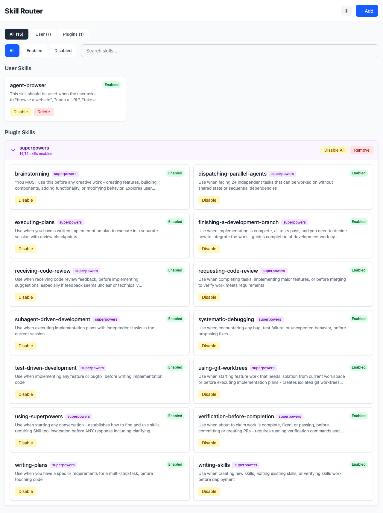
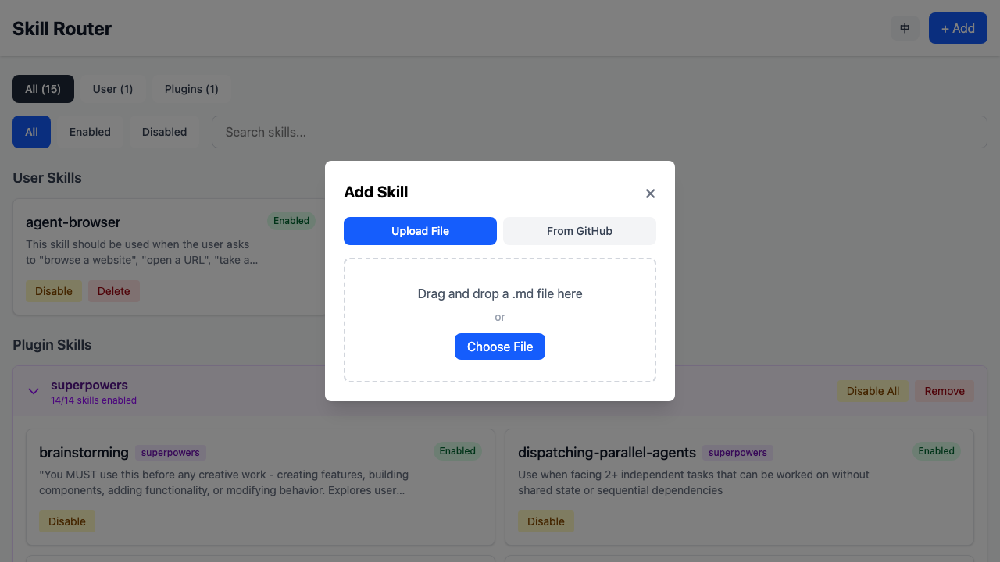

# Skill Router

一个用于管理 Claude Code 技能和插件的本地 Web 应用。



## 功能特性

- **查看所有技能** - 来自 `~/.claude/commands/` 和已安装的插件
- **启用/禁用技能** - 支持单个技能或按插件组操作
- **删除技能** - 仅限用户技能
- **上传 .md 技能文件** - 支持拖放或文件选择
- **从 GitHub 安装技能** - 输入仓库地址即可安装
- **多语言支持** - 中文和英文，自动检测浏览器语言

## 安装

从 [Releases](https://github.com/anthropics/skill-router/releases) 下载适合您平台的二进制文件。

或从源码构建：

```bash
make build
```

## 使用方法

```bash
./skill-router
```

启动服务器后会自动打开浏览器访问 http://localhost:9527

### 添加技能

点击 **+ 添加** 按钮可以：

1. **上传文件** - 拖放或选择 `.md` 技能文件
2. **从 GitHub 安装** - 输入仓库 URL，自动安装 `.claude/commands/` 目录下的所有技能



### 语言切换

界面会自动检测您的浏览器语言。点击顶部的语言切换按钮（EN/中）可手动切换。

## 开发指南

```bash
# 终端 1：运行 Go 后端
go run .

# 终端 2：运行 Vue 开发服务器
cd web && npm run dev
```

然后访问 http://localhost:5173 进行热重载开发。

### 项目结构

```
.
├── main.go                 # 入口文件，HTTP 服务器
├── internal/
│   ├── handler/            # HTTP 处理器
│   ├── service/            # 业务逻辑
│   └── config/             # 配置管理
├── web/                    # Vue 3 前端
│   ├── src/
│   │   ├── components/     # Vue 组件
│   │   ├── i18n/           # 国际化
│   │   └── api/            # API 客户端
│   └── dist/               # 构建产物（已嵌入）
└── docs/
    └── images/             # 截图
```

## 许可证

MIT
